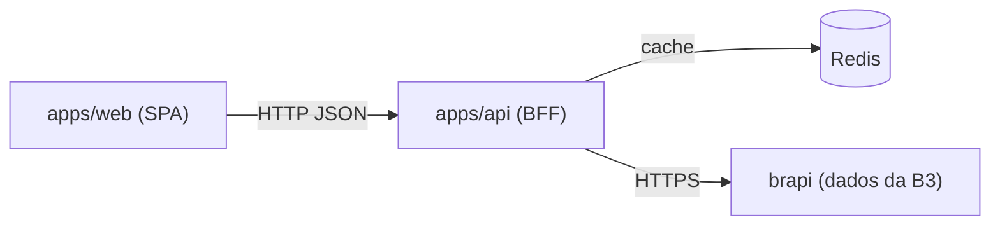

# B3ridge

[](https://github.com/yuricoutinho/b3ridge-web/actions/workflows/ci.yml)
[](./LICENSE)

Ferramenta para consultar o histórico de preços de fechamento de ativos da B3 (bolsa brasileira) e visualizar sua evolução em um gráfico de linha comparativo.

O usuário escolhe um ou mais ativos, define um período e recebe um gráfico com a evolução de cada um. Como ativos têm preços muito diferentes entre si, as séries são normalizadas em variação percentual desde o início do período, permitindo comparar tudo na mesma escala.

O projeto roda localmente (veja [Começando](#começando)); não há ambiente publicado.

Este é um monorepo com o frontend, o backend interno e os contratos compartilhados entre eles.

## Estrutura do monorepo

| Pacote               | Papel                                                                                      |
| -------------------- | ------------------------------------------------------------------------------------------ |
| `apps/web`           | SPA em React que renderiza a seleção de ativos e o gráfico.                                |
| `apps/api`           | Backend interno (BFF) que valida, busca na brapi, cacheia no Redis e projeta o payload.    |
| `packages/contracts` | Schemas Zod e tipos compartilhados entre web e api (fonte única de verdade dos contratos). |

## Documentação

| Documento                             | Onde                                                                         |
| ------------------------------------- | ---------------------------------------------------------------------------- |
| Referência da API (endpoints, shapes) | Swagger UI em `/api/docs` com a API rodando localmente (spec em `/api/docs/openapi.json`) |
| Backend: decisões e diagramas         | [`docs/architecture.md`](./docs/architecture.md)                             |
| Frontend: decisões e diagramas        | [`docs/frontend.md`](./docs/frontend.md)                                     |

O Swagger é gerado a partir dos schemas Zod em `packages/contracts`, então a referência de endpoints nunca diverge do código. Os documentos de arquitetura cobrem o "porquê" e os fluxos que uma spec não expressa, sem repetir a referência de endpoints.

## Funcionalidades

- Seleção de ativos com busca por texto (código ou nome) e seleção múltipla (até 4).
- Período por calendário ou por atalhos prontos (5D, 1M, 3M, 6M, 1A, YTD).
- Consulta sob demanda: o usuário monta o filtro e dispara a busca no botão Consultar.
- Gráfico de linha combinado, uma linha por ativo, normalizadas em variação percentual.
- Resumo de variação percentual por ativo.
- Estados de loading, erro total e falha parcial (um ativo pode falhar sem derrubar os demais).
- Layout responsivo para desktop e mobile.

## Arquitetura de dados

O frontend nunca busca preços direto na fonte externa. Ele sempre pergunta ao backend interno, que decide entre buscar novo dado ou reaproveitar o que já está em cache. Isso protege o limite de requisições da brapi e acelera consultas repetidas.



A lista de ativos (`GET /api/tickers`) e o histórico de preços em lote (`GET /api/tickers/history`) passam pelo backend, que busca na brapi, projeta o payload mínimo e cacheia no Redis. Como o plano usado na brapi limita consultas por data a janelas de 90 dias, o backend quebra períodos maiores em múltiplas requisições e mescla o resultado antes de cachear. Detalhes e diagramas em [`docs/architecture.md`](./docs/architecture.md) (backend) e [`docs/frontend.md`](./docs/frontend.md) (frontend).

## Stack

- React 19, TypeScript e Vite no frontend
- Express 5 e ioredis no backend, com Helmet e rate limiting
- Zod para validação e contratos compartilhados
- TanStack Query e Recharts para dados e gráfico
- shadcn/ui e Tailwind para a UI
- Vitest e Testing Library para testes unitários
- Oxlint para lint e Prettier para formatação
- Husky, lint-staged e Commitlint para Conventional Commits
- pnpm workspaces via corepack
- GitHub Actions para CI (lint, typecheck, testes e build)

## Começando

Requisitos: Node 24 (fixado no `.nvmrc`), pnpm via corepack e Docker (para o Redis local).

```bash
git clone https://github.com/yuricoutinho/b3ridge-web.git
cd b3ridge-web

nvm use
corepack enable
pnpm install

cp apps/api/.env.example apps/api/.env    # ajuste BRAPI_TOKEN se tiver
cp apps/web/.env.example apps/web/.env     # VITE_INTERNAL_API_URL=http://localhost:3333

docker compose up -d redis                 # Redis para o cache do backend
pnpm dev                                    # sobe web e api em paralelo
```

Com tudo no ar: frontend em `http://localhost:5173`, API em `http://localhost:3333` e Swagger em `http://localhost:3333/api/docs`.

## Variáveis de ambiente

Configure cada app com um `.env` local (a partir do seu `.env.example`).

`apps/api/.env`:

| Variável       | Obrigatória | Descrição                                                                            |
| -------------- | ----------- | ------------------------------------------------------------------------------------ |
| `PORT`         | não         | Porta do backend (padrão `3333`).                                                    |
| `CORS_ORIGINS` | sim         | Allowlist de origens separada por vírgula (nunca `*`), ex.: `http://localhost:5173`. |
| `REDIS_URL`    | sim         | Conexão do Redis, ex.: `redis://localhost:6379`.                                     |
| `BRAPI_URL`    | sim         | Base da brapi, ex.: `https://brapi.dev/api`.                                         |
| `BRAPI_TOKEN`  | não         | Token da brapi enviado como `Bearer` quando presente.                                |

`apps/web/.env`:

| Variável                | Obrigatória | Descrição                                              |
| ----------------------- | ----------- | ------------------------------------------------------ |
| `VITE_INTERNAL_API_URL` | sim         | Base do backend interno, ex.: `http://localhost:3333`. |

## Scripts (raiz)

| Script           | Descrição                                |
| ---------------- | ---------------------------------------- |
| `pnpm dev`       | Sobe web e api em paralelo.              |
| `pnpm build`     | Build de produção do frontend.           |
| `pnpm typecheck` | Checagem de tipos em todos os pacotes.   |
| `pnpm test:run`  | Testes uma vez em todos os pacotes (CI). |
| `pnpm lint`      | Lint com Oxlint.                         |
| `pnpm format`    | Formata com Prettier.                    |

Cada app também expõe seus próprios scripts (`pnpm --filter @b3ridge/api dev`, `pnpm --filter @b3ridge/web test`, etc.).

## Qualidade e CI

- Pre-commit com Husky e lint-staged: Oxlint e Prettier nos arquivos alterados.
- Commitlint valida a mensagem no padrão Conventional Commits.
- CI (`ci.yml`) roda lint, typecheck, testes e build em todo PR.

## Fora de escopo

- Não é ferramenta de negociação.
- Não fornece recomendação de investimento nem análise de ativos.
- Não mostra preço em tempo real durante o pregão, apenas fechamento diário de dias já encerrados.
- Não cobre investimentos fora de ativos com ticker na B3.
