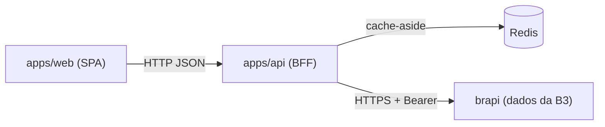
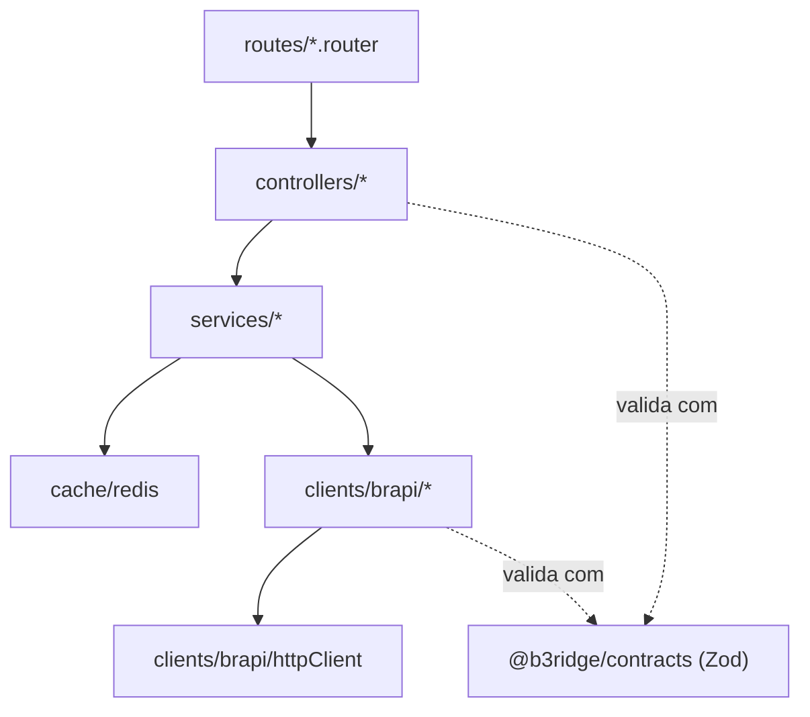
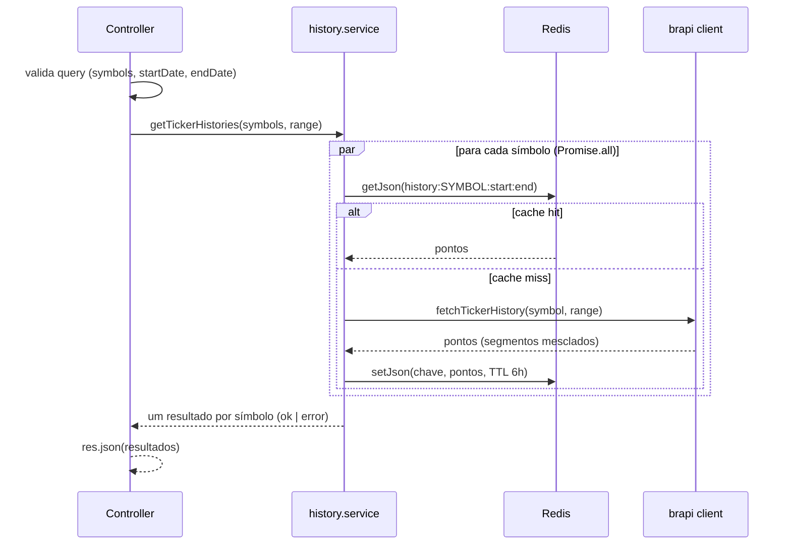
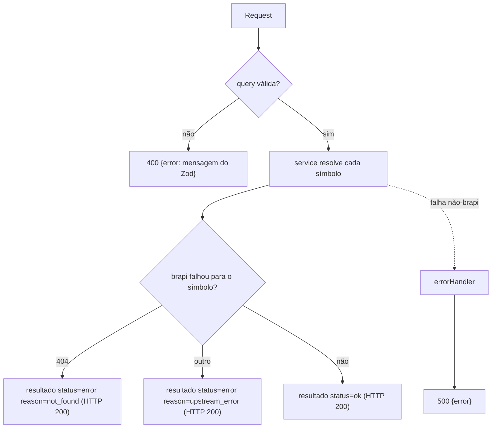
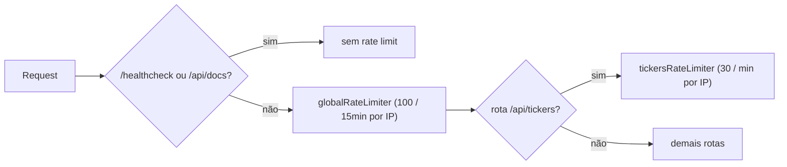

# Backend: arquitetura e decisões

Documento do backend `apps/api`. Cobre o "porquê" das decisões e os fluxos transversais.
A referência de endpoints (parâmetros, shapes de request/response) vive no Swagger em
`/api/docs` e não é repetida aqui.

## Contexto

O backend é um BFF (backend-for-frontend): a SPA nunca fala com a brapi direto. Toda
consulta passa pela API interna, que valida a entrada, busca na brapi, normaliza o
payload e cacheia no Redis.

Por que um BFF na frente da brapi:

- Esconde o `BRAPI_TOKEN` do cliente.
- Cacheia respostas e protege o limite de requisições do plano da brapi.
- Projeta o payload mínimo que o front precisa (a brapi retorna muito mais campos).
- Aplica CORS, headers de segurança (Helmet) e rate limiting no nosso domínio.

## Camadas

Cada requisição atravessa camadas com uma responsabilidade só. Dependências apontam
sempre para dentro (rota conhece controller, controller conhece service, e assim por diante).

- **routes**: montam o Express Router e aplicam middlewares (rate limit por rota).
- **controllers**: validam a entrada com os schemas dos contracts e traduzem para HTTP.
- **services**: orquestram cache e brapi, e aplicam as regras de negócio (isolamento por símbolo).
- **clients/brapi**: um subdiretório por recurso (`tickers`, `history`), cada um com seu `client`, `schema` e `mapper`/`normalize`. Todos passam pelo `httpClient` comum.
- **cache/redis**: helpers `getJson`/`setJson` que nunca lançam (falha de cache não derruba a request).

### Decisão: contratos compartilhados em Zod

Os schemas de validação e os tipos vivem em `packages/contracts` e são consumidos por
web e api. O mesmo schema que valida a query no controller define o tipo no front e
gera o componente no Swagger. Uma regra (ex.: máximo de 4 símbolos, `maxBatchSymbols`)
muda em um lugar só e se propaga para os três consumidores.

## Fluxo de uma consulta de histórico

`GET /api/tickers/history` resolve cada símbolo de forma independente e nunca derruba a
request inteira por causa de um símbolo.

### Decisão: isolamento de falha por símbolo

A resposta é uma união discriminada por símbolo: `{ status: 'ok', history }` ou
`{ status: 'error', reason }`. Um símbolo inexistente ou uma falha pontual da brapi
viram um resultado `error` no lote, e o HTTP continua `200`. Assim, pedir quatro ativos
e um estar errado ainda entrega os outros três. O front reflete isso por ativo (ver
[Erros](#modelo-de-erros)).

### Decisão: cache-aside no Redis, TTL de 6h

Estratégia cache-aside: lê do Redis, e no miss busca na brapi e grava. A chave de
histórico é `history:<symbol>:<startDate>:<endDate>` e a de catálogo é `tickers`. Como
o dado é fechamento diário de dias já encerrados (com defasagem de 3 dias), ele é
imutável dentro da janela, então um TTL de 6h é seguro e corta a maioria das idas à brapi.

Os helpers de cache engolem erros de Redis de propósito: se o Redis cair, a leitura
retorna `null` (segue para a brapi) e a escrita é ignorada. Cache é otimização, não
caminho crítico.

### Decisão: quebra de janelas maiores que 90 dias

O plano da brapi limita consultas por `startDate`/`endDate` a 90 dias. `splitDateRange`
parte o período pedido em segmentos contíguos e não sobrepostos de no máximo 90 dias;
`fetchTickerHistory` busca os segmentos em paralelo e `dedupeAndSortByDate` mescla,
remove duplicatas de borda e ordena por data. A chave de cache guarda a janela inteira,
não os segmentos, então uma segunda consulta ao mesmo período é um único hit.

## Modelo de erros

Dois eixos de erro, tratados em lugares diferentes:

- **Validação (400)**: o controller devolve a primeira mensagem de issue do Zod. Toda
  resposta de erro segue o shape `{ error: string }`.
- **Falha por símbolo (200)**: `BrapiError` com status 404 vira `not_found`; qualquer
  outra vira `upstream_error`. Fica no corpo, por símbolo, sem status HTTP de erro.
- **Falha inesperada (5xx)**: o `errorHandler` central mapeia `BrapiError` (404 -> "Ticker
  not found", senão "Upstream data source error") e qualquer outra exceção para
  `500 {error: 'Internal server error'}`, sem vazar stack trace.

No frontend, `services/client.ts` lança `ApiError` em respostas não-ok, o `queryClient`
não faz retry de 4xx (só de 5xx, até 2 vezes) e o `useTickerHistories` marca `isError`
por ativo quando o resultado daquele símbolo é `error`. Falha total dispara um toast;
falha parcial aparece no card do ativo afetado.

## Segurança e limites

- **Helmet**: headers de segurança (CSP, nosniff, anti-clickjacking, HSTS) em toda resposta.
- **CORS**: allowlist explícita via `CORS_ORIGINS`, nunca `*`.
- **Rate limiting** em duas camadas:

O `healthcheck` e o Swagger ficam antes do rate limiter global de propósito: liveness e
documentação não devem consumir cota. As rotas de tickers têm um limite próprio, mais
estrito, por serem as que chamam a brapi.

## Validação de datas (regra de negócio)

As regras de intervalo vivem nos contracts e valem para os dois lados:

- `startDate` deve ser estritamente antes de `endDate`.
- `endDate` deve ser no máximo `dataLagDays` (3) dias antes do dia de pregão atual,
  calculado no fuso `America/Sao_Paulo`. A brapi só tem fechamento de dias encerrados,
  então pedir dado recente demais é rejeitado com 400 antes de chegar na brapi.

## Notas de evolução

Pontos conhecidos, aceitáveis no escopo atual:

- O corpo do `429` do rate limiter é texto puro (padrão da lib), diferente do shape
  `{ error }` das demais respostas. Não afeta o front (o `ApiError` é lançado antes de
  parsear o corpo), mas é uma inconsistência.
- Um retorno vazio da brapi para um símbolo válido (sem pregão na janela) é cacheado
  como `ok` com histórico vazio por 6h.
- Janelas largas com muitos símbolos disparam várias chamadas paralelas à brapi
  (segmentos x símbolos) sem teto de concorrência; sob catálogo real pode encostar no
  limite do upstream.
