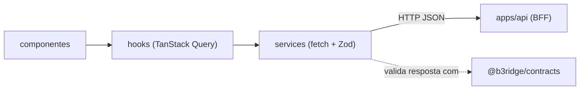
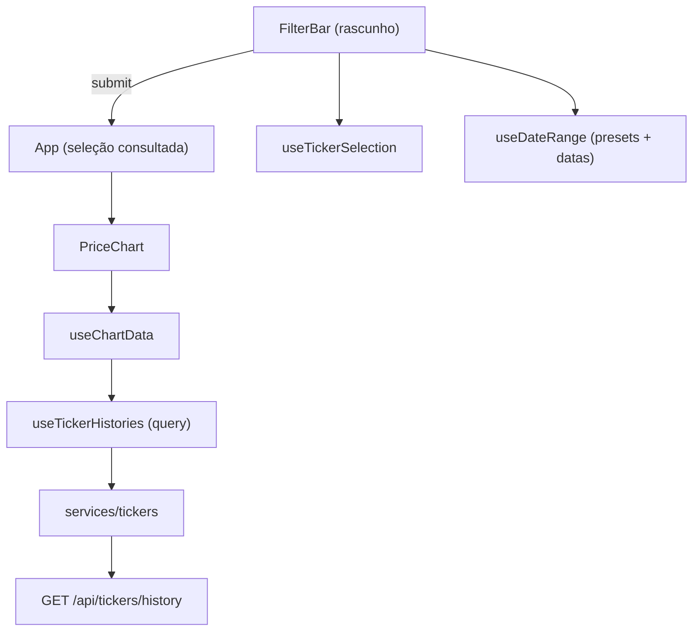

# Frontend: arquitetura e decisões

Documento do frontend `apps/web`. Cobre o "porquê" das decisões e os fluxos internos da SPA.
A visão de produto (funcionalidades, escopo) vive no [README](../README.md) e a arquitetura
do backend em [`architecture.md`](./architecture.md).

## Contexto

A SPA nunca fala com a brapi: toda consulta vai para o BFF interno, tipada de ponta a
ponta pelos schemas Zod de `@b3ridge/contracts`. O mesmo schema que valida a query no
backend valida a resposta no frontend e define os tipos dos dois lados.



## Organização do código

```
src/
  components/
    ui/               shadcn vendorado (não editar)
    ticker/
      selector/       combobox de ativos
      date-range/     campos de data, presets e calendário
      chart/          gráfico, resumo e estados (skeleton, erro, vazio)
  hooks/              estado e integração com TanStack Query
  lib/                funções puras (datas, séries, matching)
  services/           chamadas HTTP validadas com Zod
  config/             env e QueryClient
```

### Decisão: lógica fora dos componentes

Componente só compõe subcomponentes nomeados e markup. Qualquer outra coisa tem um lugar
definido:

- Regra pura (validação de intervalo, normalização de série) vai para `lib/` e é testada isolada.
- Estado e efeitos vão para `hooks/` (`useDateRange`, `useTickerHistories`, `useChartData`).
- Valor derivado vira `const` no topo do componente, nunca expressão inline no JSX.

Isso mantém os componentes triviais de ler e concentra os testes onde há lógica de verdade.

### Decisão: shadcn vendorado, sem camada de abstração

Os componentes de `components/ui/` são código gerado pelo shadcn sobre `@base-ui/react` e
são tratados como vendor: não são editados nem recebem wrappers genéricos por cima. Os
compound components (Combobox, Popover, InputGroup) são usados direto nos componentes de
feature. Customização visual acontece via tokens do design system (CSS variables) e
`className`, nunca alterando o código gerado.

## Fluxo de dados: rascunho vs consulta

A consulta é sob demanda: o usuário monta o filtro e dispara no botão Consultar. Para
isso, o estado de edição (rascunho) vive no `FilterBar` e o estado consultado vive no
`App`. Digitar uma data ou marcar um ativo não dispara request nem re-renderiza o
gráfico; só o submit propaga.



### Decisão: estado do gráfico como união discriminada

`useChartData` devolve um único objeto com `status: 'invalid-range' | 'loading' |
'error' | 'ready'`, cada variante carregando só os dados que aquele estado precisa. O
componente vira um `switch` exaustivo, sem combinações de flags booleanas (`isLoading &&
!isError && ...`) espalhadas pelo JSX. O TypeScript garante que o caso `ready` tem
`rows`, `series` e `summaries`, e que nenhum estado fica sem renderização.

### Decisão: falha parcial por ativo

A resposta do histórico é uma união discriminada por símbolo (`ok | error`), espelhando o
backend. O frontend reflete isso no mesmo grão: um ativo sem cotação vira uma linha de
aviso no card, os demais continuam no gráfico. Só quando todos falham o gráfico dá lugar
ao estado de erro. Falha de rede da request inteira dispara toast via `meta` da query.

## TanStack Query

Configuração central em `config/queryClient.ts`, decidida em função do dado (fechamento
diário de dias já encerrados, imutável dentro da janela):

| Config                              | Valor            | Porquê                                                        |
| ----------------------------------- | ---------------- | ------------------------------------------------------------- |
| `staleTime`                         | 5 min            | O dado não muda dentro da sessão; evita refetch inútil.       |
| `gcTime`                            | 30 min           | Voltar a um filtro recente reaproveita o cache.               |
| `refetchOnWindowFocus`/`Reconnect`  | off              | Dado imutável; refetch em foco só gastaria a cota do backend. |
| `retry`                             | 2x, nunca em 4xx | 4xx é erro de input, repetir não resolve.                     |
| `placeholderData`                   | `keepPreviousData` | Troca de filtro mantém o gráfico anterior até a nova resposta. |

A chave do histórico é `['tickers', 'history', symbols, range]` com `symbols` ordenado:
a mesma seleção em ordem diferente é o mesmo cache. Toasts de sucesso/erro são
declarados via `meta` da query e disparados centralmente no `QueryCache`, sem `useEffect`
nos componentes.

## Performance e code-splitting

O gráfico e o calendário não entram no bundle inicial (números do build de produção,
minificados):

- **recharts** (~343 kB, maior dependência do app) carrega via `React.lazy` no
  `PriceChartCanvas`, só quando a primeira consulta rende um gráfico. O skeleton de
  loading cobre o fetch e o download do chunk de uma vez.
- **react-day-picker** (~58 kB com a parte de date-fns que só ele usa) carrega via
  `React.lazy` no `DateFieldCalendar`, com preload no hover/focus do botão do
  calendário: o chunk baixa antes do popover abrir, então não há flash.

Fora isso, nada de memoização preventiva: o rascunho isolado no `FilterBar` já impede
re-render do gráfico durante a edição, e o dataset (até 4 ativos x pregões do período) é
pequeno demais para `useMemo`/`useCallback` pagarem o próprio custo.

## Validação de resposta

`services/client.ts` faz `safeParse` com o schema do contrato em toda resposta. Resposta
não-ok ou com shape inesperado vira `ApiError` com status, que alimenta a política de
retry do `queryClient`. Payload malformado do backend falha alto e cedo, nunca chega ao
gráfico.

## Testes

Testes cobrem só o core: funções puras de `lib/` (datas, normalização percentual, merge
de séries), os hooks com lógica (`useChartData`, `useDateRange`, `useTickerHistories`) e
a validação dos services. Sem testes de markup trivial nem de comportamento de
biblioteca. `describe`/`it` e mensagens de erro sempre em inglês.
